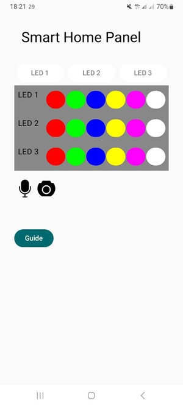
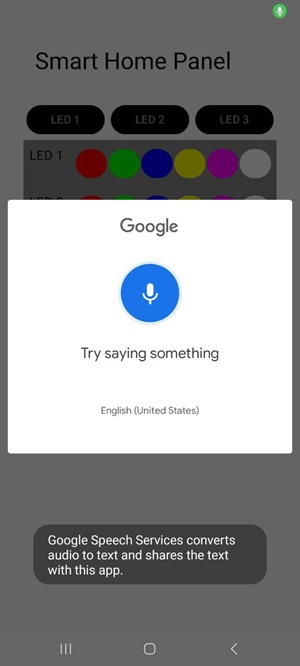
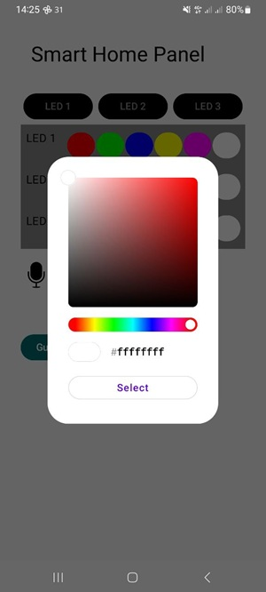
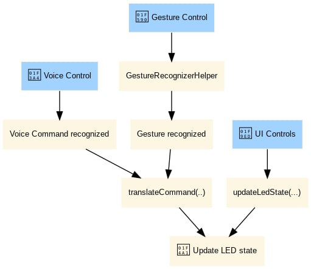

# Multimodal LED Control

A multimodal smart lighting system that enables real-time control of RGB LEDs using touch, voice commands, and hand gestures via an Android application and Arduino.

> This project demonstrates the integration of mobile development, embedded systems, and computer vision in a single interactive system.
---

## Demo

  
  
  
  

---

## Overview

This project is a multimodal LED control system built with Android and Arduino. The Android app allows the user to control three RGB LEDs through three different interaction modes:

- Touch-based control through a Jetpack Compose interface  
- Voice commands using Android speech recognition  
- Hand gestures using MediaPipe and CameraX  

The app sends LED state data to an Arduino board through Bluetooth, and the Arduino updates the LEDs in real time.

  

---

## Features

- Control 3 RGB LEDs from an Android app  
- Manual color selection with buttons and color picker  
- Voice commands for turning lights on/off and changing colors  
- Gesture recognition mapped to LED commands  
- Bluetooth communication with Arduino  
- Real-time LED state updates  

---

## Key Concepts Demonstrated

- Bluetooth communication between Android and embedded devices  
- Real-time state synchronization  
- Gesture recognition using MediaPipe  
- Voice command processing and mapping  
- MVVM-based state management  
- Byte-level communication protocol design  

---

## Tech Stack

### Android
- Kotlin  
- Jetpack Compose  
- Android Bluetooth API  
- Google Speech Recognition  
- MediaPipe Gesture Recognizer  
- CameraX  
- MVVM architecture  

### Hardware
- Arduino Uno  
- HC-06 Bluetooth module  
- 3 RGB LEDs  
- Resistors  
- Breadboard  

---

## Project Structure

- `MainActivity.kt` – app entry point, gesture-to-command mapping, Bluetooth communication  
- `LedController.kt` – LED state logic, voice command handling, main UI  
- `DeviceScreen.kt` – Bluetooth device selection and connection  
- `CameraScreen.kt` – gesture recognition pipeline using camera  
- `GestureRecognizerHelper.kt` – MediaPipe gesture processing  
- `Utils.kt`, `Packet.kt`, `Step.kt` – Bluetooth packet creation and formatting  

---

## How It Works

1. The user selects a Bluetooth device from the Android app  
2. The app connects to the Arduino via Bluetooth socket  
3. The user interacts using touch, voice, or gestures  
4. The app converts LED states into byte packets  
5. Packets are transmitted to Arduino  
6. Arduino decodes the data and updates LED colors using PWM  

---

## Gesture Commands

- `Thumb_Up` → turn on all lights  
- `Thumb_Down` → turn off all lights  
- `Open_Palm` → set all blue  
- `Closed_Fist` → set all red  
- `Pointing_Up` → set all yellow  
- `Victory` → set all green  
- `ILoveYou` → set all purple  

---

## Voice Commands

Examples:
- `turn on all lights`  
- `turn off all lights`  
- `light one blue`  
- `light two red`  
- `light three green`  
- `set all yellow`  

---

## Requirements

### Software
- Android Studio  
- Android device with Bluetooth  
- Minimum supported Android version  
- MediaPipe gesture model  

### Hardware
- Arduino Uno  
- HC-06 Bluetooth module  
- RGB LEDs + resistors  

---

## Important Note

The gesture recognition system depends on the MediaPipe model file:
app/src/main/assets/
Otherwise, gesture recognition will not work.

---

## Arduino Side

The Arduino receives LED packets via serial Bluetooth communication and updates LED states accordingly.

- LED1 & LED2 → hardware PWM  
- LED3 → software-based PWM simulation  

---

## Limitations

- Uses pretrained gesture model (no custom training)  
- Limited number of gesture commands  
- Bluetooth range constraints  
- Moderate robustness to noise in voice/gesture input  

---

## Future Improvements

- Custom gesture training  
- More flexible voice commands  
- UI improvements  
- Scheduling and automation features  
- Improved Bluetooth stability  

---

## Author

**Seyedamin Hosseini**
